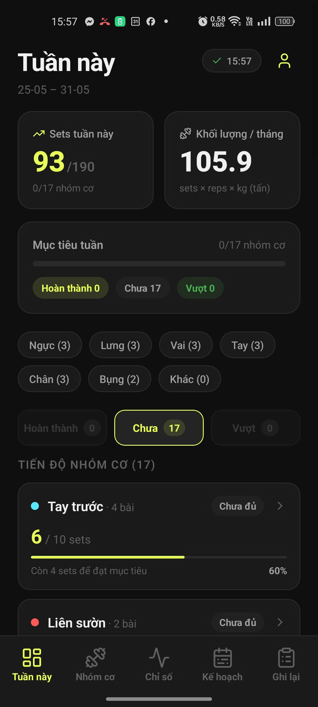
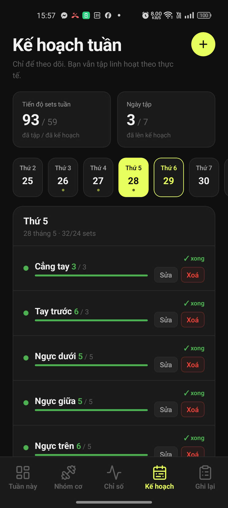
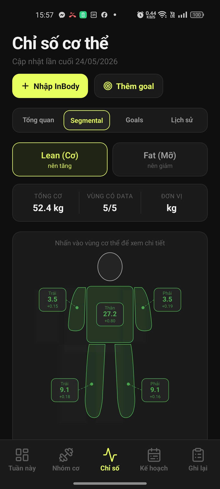
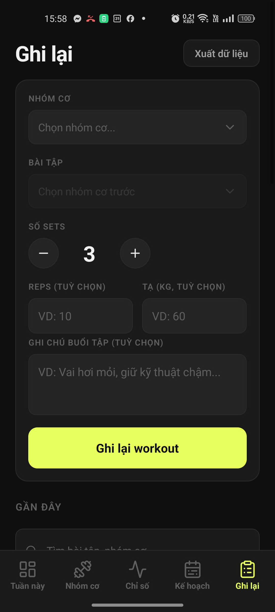

# Muscle Exercise Manager

Ứng dụng workout tracking **offline-first**, tối ưu cho việc ghi log nhanh, lưu local ổn định và tự động đồng bộ cloud khi có mạng. Hỗ trợ Google Sign-In và chế độ khách.

---

## Screenshots

| Dashboard | Weekly Plan | Body Metrics | Log Workout |
|-----------|-------------|--------------|-------------|
|  |  |  |  |

---

## Tính năng chính

- **Weekly Plan** — lập kế hoạch theo ngày và nhóm cơ, theo dõi tiến độ sets thực tế so với mục tiêu; hiển thị nhóm cơ ngoài kế hoạch và thêm nhanh vào ngày hiện tại.
- **Dashboard** — tổng quan sets tuần (actual/target), khối lượng tháng, trạng thái từng nhóm cơ (hoàn thành / chưa đủ / vượt mục tiêu).
- **Body Metrics** — nhập tay hoặc quét, UI tab rõ ràng, dễ bảo trì.
- **Workout Log** — thêm, sửa, xoá theo từng bài tập; hỗ trợ soft delete.
- **Offline-first** — toàn bộ dữ liệu lưu local bằng SQLite, đồng bộ Supabase khi có mạng, dirty sync ổn định.
- **Ảnh minh hoạ** — upload lên MinIO, đồng bộ tự động khi online.

---

## Tech Stack

| Layer | Công nghệ |
|---|---|
| Mobile / Web | Expo · React Native · TypeScript |
| Local store | SQLite |
| Auth + Sync | Supabase |
| Image storage | MinIO |

---

## Quick Start

```bash
git clone https://github.com/devmindtan/muscle-exercise-manager.git
cd muscle-exercise-manager
npm install
npx expo start
```

---

## Cấu hình môi trường

Tạo file `.env` ở root:

```env
EXPO_PUBLIC_SUPABASE_URL=
EXPO_PUBLIC_SUPABASE_KEY=

# MinIO — hai biến dưới được hỗ trợ như alias của nhau
EXPO_PUBLIC_MINIO_ENDPOINT=
EXPO_PUBLIC_MINIO_PUBLIC_BASE_URL=
EXPO_PUBLIC_MINIO_BUCKET=muscle-manager

# Google Sign-In — hai biến dưới được hỗ trợ như alias của nhau
EXPO_PUBLIC_WEB_CLIENT_ID=
EXPO_PUBLIC_GOOGLE_WEB_CLIENT_ID=

# Cần khớp với Callback URL trong Supabase Auth khi deploy web
EXPO_PUBLIC_WEB_REDIRECT_URL=
```

---

## Build Web

```bash
npm run build:web
```

> Deploy lên Vercel hoặc Netlify: đảm bảo `EXPO_PUBLIC_WEB_REDIRECT_URL` trùng với callback URL đã cấu hình trong Supabase Auth.

---

## Releases

| Tag | Trạng thái |
|-----|------------|
| `v1.0.1-preview` | Latest |
| `v1.0.0-preview` | Stable |

---

## License

[MIT](./LICENSE)