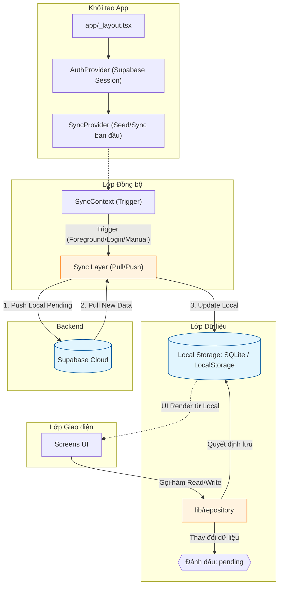

# Dataflow Tổng Quan Dự Án

Tài liệu này mô tả luồng dữ liệu của toàn bộ dự án và luồng dữ liệu của từng chức năng chính trong app.

## 1. Dataflow tổng quan của toàn dự án

### 1.1. Các lớp chính

- UI layer: các màn hình trong `app/`
- Context layer: `AuthContext` và `SyncContext`
- Data layer: `lib/repository.ts` cho native, `lib/repository.web.ts` cho web
- Sync layer: `lib/sync.ts` cho native, `lib/sync.web.ts` cho web
- Persistence layer:
  - Native: `expo-sqlite`
  - Web: `localStorage`
- Cloud layer: Supabase cho auth và đồng bộ dữ liệu native

### 1.2. Luồng dữ liệu tổng quát

1. App khởi động tại `app/_layout.tsx`.
2. `AuthProvider` đọc session hiện tại từ Supabase.
3. `SyncProvider` chạy seed/sync ban đầu.
4. UI của từng màn hình gọi các hàm trong `lib/repository` để đọc và ghi dữ liệu.
5. Repository quyết định lưu vào SQLite hay `localStorage` tùy nền tảng.
6. Khi có thay đổi dữ liệu, repository đánh dấu bản ghi là `pending`.
7. `SyncContext` kích hoạt đồng bộ khi app vào foreground, khi user đăng nhập, hoặc khi người dùng bấm sync.
8. Sync layer đẩy dữ liệu local lên Supabase, sau đó kéo dữ liệu mới từ Supabase về local.
9. UI render lại từ local storage, không phụ thuộc trực tiếp vào network trong lúc người dùng thao tác.

### 1.3. Mục tiêu thiết kế

- Native: offline-first, có local DB bền vững, có thể sync sau.
- Web: chạy không lỗi bundle SQLite, dùng `localStorage` để giữ dữ liệu giữa các lần reload trong trình duyệt.
- UI luôn đọc từ local layer để thao tác nhanh.
- Sync cloud là lớp phụ trợ, không chặn thao tác CRUD.

## 2. Dataflow theo chức năng

## 2.1. Khởi động app và layout

File liên quan:

- `app/_layout.tsx`
- `app/(tabs)/_layout.tsx`
- `app/auth-callback.tsx`

Luồng:

1. `app/_layout.tsx` bọc toàn bộ app bằng `AuthProvider` và `SyncProvider`.
2. `Stack` khai báo các route chính: tabs, auth callback, not found.
3. `app/(tabs)/_layout.tsx` dựng bottom tab navigation và tính safe-area cho mobile/web.
4. `app/auth-callback.tsx` là màn hình đón redirect từ Google OAuth trên web/native.
5. Khi callback hoàn tất, app quay về nhóm tab chính.

## 2.2. Đăng nhập Google

File liên quan:

- `lib/auth.ts`
- `context/AuthContext.tsx`
- `app/auth-callback.tsx`
- `context/SyncContext.tsx`

Luồng:

1. Người dùng bấm nút đăng nhập trong `SyncStatusChip` hoặc nơi gọi `signIn()`.
2. `AuthContext` gọi `signInWithGoogle()` trong `lib/auth.ts`.
3. Native dùng `expo-web-browser` và deep link redirect.
4. Web dùng redirect URL trên trình duyệt.
5. Supabase trả session về client.
6. `AuthContext` cập nhật `session` và `user`.
7. `SyncContext` thấy có session mới thì kích hoạt sync.
8. UI có thể hiển thị trạng thái đã đăng nhập hoặc trạng thái đồng bộ.

## 2.3. Đồng bộ dữ liệu

File liên quan:

- `lib/sync.ts`
- `lib/sync.web.ts`
- `context/SyncContext.tsx`
- `lib/repository.ts`
- `lib/repository.web.ts`

Luồng native:

1. `SyncProvider` gọi `seedFromSupabase()` khi app mount.
2. Nếu local DB còn trống, app kéo dữ liệu đầu tiên từ Supabase.
3. `SyncProvider` gọi `syncAll()`.
4. `pushPendingChanges()` đẩy các row local có `sync_status = pending` lên Supabase.
5. `pullRemoteChanges()` kéo dữ liệu remote theo `updated_at`.
6. Dữ liệu mới được ghi về local SQLite.
7. `last_pull_at` được lưu vào bảng `app_meta`.
8. UI đọc lại từ local DB và cập nhật hiển thị.

Luồng web:

1. `repository.web.ts` lưu dữ liệu vào `localStorage` với key `muscle-manager:web-state`.
2. Khi user đăng nhập, `sync.web.ts` kích hoạt thực sync với Supabase (không phải no-op).
3. `seedFromSupabase()` detect nếu user đổi (so sánh `last_user_id`):
   - Nếu user khác → clear dữ liệu cũ, reset metadata, pull dữ liệu của user mới.
   - Nếu user mới → pull full data từ Supabase.
4. `pushPendingChanges()` gửi các row `sync_status = 'pending'` lên Supabase với `user_id` được gán.
5. `pullRemoteChanges()` kéo dữ liệu từ Supabase filter theo `user_id = current_user`.
6. Metadata (`muscle-manager:web-meta`) lưu `last_pull_at` và `last_user_id` để detect user switch.
7. Dữ liệu vẫn tồn tại giữa các lần reload trong cùng trình duyệt nhờ `localStorage`, nhưng bị clear khi user thay đổi.

## 2.4. Dashboard tuần này

## 2.4. Tài khoản người dùng và chuyển đổi user

File liên quan:

- `components/UserAccountModal.tsx`
- `context/AuthContext.tsx`
- `lib/auth.ts`
- `lib/sync.web.ts`

Luồng:

1. Người dùng bấm icon 👤 (User Account) ở header.
2. Modal tài khoản mở ra hiển thị:
   - Tên user (từ Google metadata)
   - Email tài khoản
   - **UUID (User ID)** — định danh duy nhất dùng để tách dữ liệu
   - Nhà cung cấp (Google)
   - Ghi chú về tách dữ liệu
3. Nút **Đăng xuất** trong modal gọi `signOut()`.
4. Khi đăng xuất:
   - Session được xoá từ Supabase.
   - `AuthContext` update `user = null`.
   - UI trở về trạng thái chưa đăng nhập.
5. Khi đăng nhập account khác:
   - `seedFromSupabase()` detect `last_user_id !== new_user_id`.
   - localStorage bị clear (dữ liệu cũ xoá).
   - Metadata reset, pull dữ liệu mới của user mới từ Supabase.
6. Mỗi user có dữ liệu riêng biệt trên Supabase, được tách bởi `user_id`.

## 2.5. Dashboard tuần này

File liên quan:

- `app/(tabs)/index.tsx`
- `lib/repository.ts`
- `lib/repository.web.ts`

Luồng:

1. Màn hình Dashboard mount hoặc được focus.
2. `load()` tính khoảng thời gian của tuần hiện tại.
3. Màn hình gọi `getMuscleGroupsWithWeeklyStats(start, end)`.
4. Repository đọc danh sách nhóm cơ và tổng sets trong tuần.
5. `ProgressBar` nhận `value`, `target`, `color` để hiển thị tiến độ.
6. UI hiển thị tổng sets, số nhóm đạt mục tiêu, và danh sách tiến độ.
7. Người dùng kéo refresh thì `onRefresh()` gọi `load()` lại.
8. `SyncStatusChip` hiển thị trạng thái sync ở header.

## 2.5. Danh sách nhóm cơ

File liên quan:

- `app/(tabs)/muscles.tsx`
- `lib/repository.ts`
- `lib/repository.web.ts`
- `lib/image.ts`

Luồng:

1. Màn hình `muscles` mount hoặc focus.
2. `load()` gọi `getMuscleGroups()`.
3. Repository trả danh sách nhóm cơ đang hoạt động, đã sắp theo ngày tạo.
4. UI render từng card nhóm cơ.
5. Nếu nhóm cơ có `image_uri`, UI hiển thị ảnh minh hoạ.
6. Khi người dùng bấm nút thêm, form modal mở ra.
7. Khi người dùng chọn ảnh, `persistImageLocally()` được gọi.
8. Native copy ảnh vào thư mục bền vững; web giữ URI hiện tại.
9. Khi bấm lưu, `insertMuscleGroup()` ghi dữ liệu xuống local layer.
10. Sau đó màn hình load lại để hiển thị nhóm cơ mới.

## 2.6. Chi tiết nhóm cơ

File liên quan:

- `app/muscles/[id].tsx`
- `lib/repository.ts`
- `lib/repository.web.ts`
- `lib/image.ts`

Luồng:

1. Màn hình nhận `id` từ route.
2. `load()` đồng thời gọi:
   - `getMuscleGroup(id)` để lấy thông tin nhóm cơ
   - `getExercises(id)` để lấy danh sách bài tập
   - `getSetCounts(id, start, end)` để tính sets tuần và tháng
3. UI hiển thị header, ảnh nhóm cơ, progress theo tuần/tháng.
4. Khi sửa nhóm cơ, `updateMuscleGroup()` cập nhật local storage/SQLite.
5. Khi xoá nhóm cơ, app không hard delete; `softDeleteMuscleGroup()` đánh dấu `deleted_at`.
6. Khi thêm bài tập, form modal gọi `insertExercise()`.
7. Khi chọn ảnh bài tập, `persistImageLocally()` xử lý tương tự nhóm cơ.
8. Khi sửa bài tập, `updateExercise()` cập nhật tên, notes, ảnh, và trạng thái active.
9. Khi bấm vô hiệu hoá/bật lại, `updateExercise()` đổi `is_active`.
10. Danh sách bài tập sau đó được load lại để phản ánh trạng thái mới.

## 2.7. Ghi lại workout

File liên quan:

- `app/(tabs)/log.tsx`
- `lib/repository.ts`
- `lib/repository.web.ts`

Luồng:

1. Màn hình `log` mount hoặc focus.
2. `load()` lấy:
   - danh sách nhóm cơ qua `getMuscleGroups()`
   - danh sách log gần đây qua `getRecentLogs(50)`
3. Khi người dùng chọn nhóm cơ, `loadExercises(groupId)` gọi `getActiveExercises(groupId)`.
4. User chọn bài tập, nhập sets/reps/weight/note.
5. Khi bấm ghi lại, `insertWorkoutLog()` ghi log mới xuống local layer.
6. Ghi chú buổi tập được lưu trong cột `note`.
7. Recent logs hiển thị search, filter, phân trang 10 bản ghi mỗi lượt.
8. Khi người dùng xoá log, `softDeleteWorkoutLog()` đánh dấu `deleted_at`.
9. UI load lại để cập nhật danh sách log và phần thống kê.

## 2.8. Ảnh minh hoạ

File liên quan:

- `lib/image.ts`
- `app/(tabs)/muscles.tsx`
- `app/muscles/[id].tsx`

Luồng:

1. User chọn ảnh từ thư viện.
2. Image picker trả về URI tạm.
3. `persistImageLocally(pickerUri)` được gọi.
4. Native copy ảnh vào `documentDirectory/muscle_images/`.
5. Web trả luôn URI gốc để tránh lỗi bundle native filesystem.
6. URI được lưu vào `image_uri` của nhóm cơ hoặc bài tập.
7. UI dùng `<Image source={{ uri: ... }} />` để render.
8. Nếu dùng native, ảnh vẫn tồn tại sau restart app.
9. Nếu dùng web, ảnh chỉ bền trong local state/localStorage tùy luồng hiện tại; muốn đồng bộ xuyên thiết bị thì cần upload storage cloud.

## 2.9. Bottom tab navigation và safe area

File liên quan:

- `app/(tabs)/_layout.tsx`

Luồng:

1. Layout đọc `useSafeAreaInsets()`.
2. Native lấy padding bottom theo home indicator.
3. Web cộng thêm offset riêng để tránh browser chrome che tab bar.
4. Tab bar được render với chiều cao động.
5. Mục đích là giữ text/icon không bị đè bởi thanh điều hướng hoặc trình duyệt.

## 3. Dataflow tạo - sửa - xoá (CRUD)

### 3.1. Tạo nhóm cơ

File liên quan: `app/(tabs)/muscles.tsx`, `lib/repository.ts / repository.web.ts`

Luồng:

1. Người dùng bấm nút thêm nhóm cơ, form modal mở ra.
2. Người dùng điền tên, màu, mục tiêu sets/tuần/tháng, chọn ảnh tuỳ chọn.
3. Nếu có ảnh, `persistImageLocally()` copy ảnh vào thư mục bền vững (native) hoặc giữ URI gốc (web).
4. Bấm lưu → `insertMuscleGroup({ name, color, target_sets_per_week, target_sets_per_month, image_uri })`.
5. Repository gán `id` (UUID), `created_at`, `updated_at`, `sync_status: 'pending'`, **`user_id` từ session hiện tại**.
6. Native: row được INSERT vào SQLite. Web: row được push vào mảng `muscle_groups` trong localStorage.
7. Màn hình load lại danh sách nhóm cơ.
8. `SyncContext` khi trigger sẽ gọi `pushPendingChanges()` → upsert row lên Supabase → đánh dấu `synced`.

### 3.2. Sửa nhóm cơ

File liên quan: `app/muscles/[id].tsx`, `lib/repository.ts / repository.web.ts`

Luồng:

1. Người dùng mở màn hình chi tiết nhóm cơ, bấm chỉnh sửa.
2. Form pre-fill dữ liệu hiện tại (tên, màu, mục tiêu, ảnh).
3. Người dùng thay đổi và bấm lưu.
4. `updateMuscleGroup(id, { ...fields })` được gọi.
5. Repository cập nhật `updated_at = now()`, `sync_status = 'pending'` và ghi vào local layer.
6. Màn hình load lại để hiển thị dữ liệu mới.
7. Sync engine đẩy row đã cập nhật lên Supabase bằng upsert.

### 3.3. Xoá nhóm cơ (soft delete)

File liên quan: `app/muscles/[id].tsx`, `lib/repository.ts / repository.web.ts`

Luồng:

1. Người dùng bấm xoá nhóm cơ trong màn hình chi tiết.
2. `softDeleteMuscleGroup(id)` được gọi.
3. Repository set `deleted_at = now()`, `sync_status = 'pending'` — **không xoá row khỏi local DB**.
4. Các query đọc (`getMuscleGroups`, v.v.) lọc bỏ row có `deleted_at IS NOT NULL`.
5. Khi sync, `pushPendingChanges()` nhận diện row có `deleted_at` → gọi hard delete trên Supabase: `supabase.from(table).delete().in('id', ids)`.
6. Sau khi xoá thành công, `sync_status` được cập nhật thành `'synced'` trong local layer.

### 3.4. Tạo bài tập

File liên quan: `app/muscles/[id].tsx`, `lib/repository.ts / repository.web.ts`

Luồng:

1. Người dùng bấm thêm bài tập trong màn hình chi tiết nhóm cơ.
2. Form nhập tên, ghi chú, ảnh tuỳ chọn.
3. Bấm lưu → `insertExercise({ muscle_group_id, name, notes, image_uri })`.
4. Repository gán id, timestamps, `is_active: true`, `sync_status: 'pending'`, **`user_id` từ session hiện tại**.
5. Ghi vào SQLite (native) hoặc localStorage (web).
6. Danh sách bài tập load lại.
7. Sync đẩy lên Supabase qua upsert.

### 3.5. Sửa bài tập

File liên quan: `app/muscles/[id].tsx`, `lib/repository.ts / repository.web.ts`

Luồng:

1. Người dùng bấm sửa bài tập, form modal pre-fill dữ liệu.
2. Thay đổi tên / ghi chú / ảnh, bấm lưu.
3. `updateExercise(id, { name, notes, image_uri })` được gọi.
4. Repository cập nhật `updated_at`, `sync_status: 'pending'`.
5. Sync upsert row mới lên Supabase.

### 3.6. Vô hiệu hoá / bật lại bài tập

File liên quan: `app/muscles/[id].tsx`, `lib/repository.ts / repository.web.ts`

Luồng:

1. Người dùng bấm nút vô hiệu hoá hoặc bật lại bài tập.
2. `updateExercise(id, { is_active: false/true })` được gọi.
3. Đây là **update thông thường**, không phải soft delete — row vẫn tồn tại.
4. Danh sách bài tập đang hoạt động (`getActiveExercises`) sẽ lọc bỏ các bài bị vô hiệu hoá.
5. Sync upsert row cập nhật lên Supabase.

### 3.7. Thêm workout log

File liên quan: `app/(tabs)/log.tsx`, `lib/repository.ts / repository.web.ts`

Luồng:

1. Người dùng chọn nhóm cơ → chọn bài tập → nhập sets / reps / weight / note.
2. Bấm ghi lại → `insertWorkoutLog({ muscle_group_id, exercise_id, sets, reps, weight, note })`.
3. Repository gán id, `logged_at = now()`, `sync_status: 'pending'`, **`user_id` từ session hiện tại**.
4. Ghi vào SQLite hoặc localStorage.
5. Màn hình load lại recent logs và dashboard stats.
6. Sync upsert row lên Supabase.

### 3.8. Xoá workout log (soft delete)

File liên quan: `app/(tabs)/log.tsx`, `lib/repository.ts / repository.web.ts`

Luồng:

1. Người dùng vuốt hoặc bấm xoá log trong danh sách recent.
2. `softDeleteWorkoutLog(id)` được gọi.
3. Repository set `deleted_at = now()`, `sync_status = 'pending'`.
4. Các query lọc bỏ row có `deleted_at`, UI cập nhật ngay.
5. Sync nhận diện row có `deleted_at` → hard delete trên Supabase → mark `synced`.

### 3.9. Upload ảnh

File liên quan: `lib/image.ts`

Luồng:

1. Người dùng mở picker ảnh.
2. Picker trả về URI tạm.
3. `persistImageLocally(pickerUri)` được gọi:
   - Native: copy file vào `documentDirectory/muscle_images/<uuid>.jpg` → trả về đường dẫn bền vững.
   - Web: trả về URI gốc (blob hoặc data URL) như cũ.
4. URI bền vững được gán vào `image_uri` của row nhóm cơ hoặc bài tập.
5. Row được đánh dấu `sync_status: 'pending'`.
6. Khi sync, `image_uri` (đường dẫn local) được đẩy lên Supabase cùng row.
7. **Lưu ý**: `image_uri` là đường dẫn thiết bị, không phải URL cloud → ảnh chỉ hiển thị đúng trên thiết bị đã tạo; cần tích hợp Supabase Storage nếu muốn đồng bộ ảnh xuyên thiết bị.

## 4. Dataflow theo entity dữ liệu

### 3.1. Muscle Group

- Tạo từ tab `Nhóm cơ`.
- Sửa/xoá từ màn hình chi tiết nhóm cơ.
- Được dùng ở Dashboard để tính progress tuần.
- Được dùng ở Log để lọc và chọn nhóm cơ.
- Có thể chứa ảnh minh hoạ.

### 3.2. Exercise

- Tạo/sửa/vô hiệu hoá trong màn hình chi tiết nhóm cơ.
- Được chọn trong màn hình ghi log.
- Có ảnh minh hoạ và ghi chú riêng.
- Không xoá cứng, chỉ soft delete hoặc disable.

### 3.3. Workout Log

- Tạo từ màn hình ghi workout.
- Dùng cho dashboard tổng hợp sets tuần/tháng.
- Hiển thị ở recent logs với search/filter/pagination.
- Hỗ trợ ghi chú buổi tập.

### 3.4. Sync metadata

- `sync_status`: theo dõi row local còn pending hay đã sync.
- `updated_at`: dùng để push/pull incremental.
- `deleted_at`: thay cho hard delete.
- `user_id`: chuẩn bị cho phân tách dữ liệu theo account.
- `user_id`: gắn với mỗi row để tách dữ liệu theo user (UUID từ Google OAuth).
- `last_pull_at`: lưu mốc pull gần nhất trong local meta (web: `muscle-manager:web-meta`).
- **`last_user_id`** (web only): lưu UUID của user cuối cùng, dùng để detect user switch → clear dữ liệu cũ.

## 4. Kết luận ngắn

App hiện đang đi theo mô hình:

- UI -> Repository -> Local persistence -> Sync -> Supabase

với nguyên tắc:

- UI không đọc trực tiếp Supabase.
- Native ưu tiên SQLite local-first.
- Web dùng `localStorage` để tránh lỗi bundle native filesystem/database.
- Sync cloud là lớp bổ sung, không chặn trải nghiệm CRUD.
- **Tách dữ liệu theo user**: Mỗi user có UUID riêng, dữ liệu được tách hoàn toàn (Supabase RLS + web localStorage clearing).
- **User switching**: Khi user A → user B, web tự động clear dữ liệu cũ, pull data của user B (native: tương tự, pull from Supabase).
- **Account modal**: Người dùng có thể xem tài khoản (tên, email, UUID) và đăng xuất từ icon 👤 ở header.
