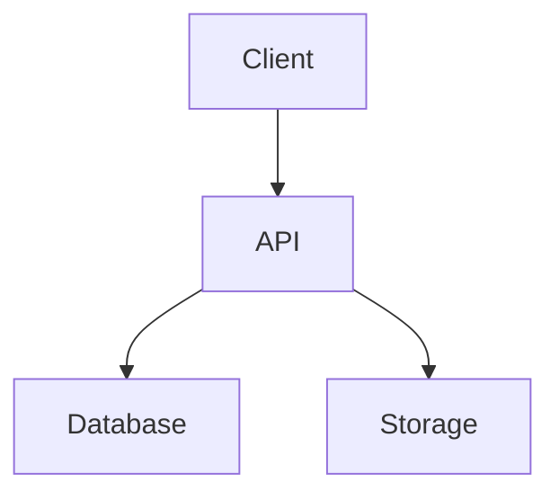

## Purpose

This skill defines how to write a professional `README.md` for software projects.

The goal of a README is NOT to explain every line of code.

The goal is to help developers quickly understand:
- What the project is
- What problem it solves
- How the system works
- How to run the project
- How to contribute

A good README acts as:
- The face of the project
- Developer onboarding documentation
- A technical navigation map
- A project showcase

---

# Core Philosophy

## README SHOULD focus on:
- Product overview
- Features
- Architecture
- Setup instructions
- Usage guidance
- Developer onboarding
- Technical overview

## README SHOULD NOT focus on:
- Coding diary
- Daily bug fixes
- Commit history
- Detailed algorithm implementation
- Explaining every line of code
- Personal development notes

Those belong in:
- Code comments
- Git commits
- Documentation folders
- Wiki pages

---

# Standard README Structure

## 1. Project Title

The project title should appear at the top of the file.

Example:
```md
# Muscle Exercise Manager
```

---

## 2. Introduction / Overview

### Purpose
Quickly explain:
- What the project is
- Who it is for
- What problem it solves

### Rules
- Keep it short
- 2–5 sentences maximum
- Focus on product value

### Example
```md
Offline-first workout tracking application optimized for fast logging and cloud synchronization.
```

---

## 3. Screenshots / Demo

Optional but highly recommended.

Can include:
- Screenshots
- GIF demos
- Video preview links

---

## 4. Features

### Purpose
List core functionalities.

### Rules
- Use bullet points
- Keep concise
- Focus on user-facing capabilities

### Example
```md
## Features

- Offline-first support
- Cloud synchronization
- Exercise grouping
- Search & filtering
- Authentication
```

---

## 5. Tech Stack

### Purpose
Show technologies used in the project.

### Example
```md
## Tech Stack

- Frontend: React Native
- Backend: Node.js
- Database: PostgreSQL
- Styling: TailwindCSS
```

---

# Getting Started Section

This is one of the MOST important sections.

---

## 6. Prerequisites

### Example
```md
## Prerequisites

- Node.js >= 20
- npm >= 10
- Docker
- PostgreSQL
```

---

## 7. Installation

### Example
```bash
git clone https://github.com/username/project-name.git

cd project-name

npm install
```

---

## 8. Environment Variables

### IMPORTANT
NEVER expose:
- API keys
- Passwords
- Tokens
- Secrets

### Example
```env
DATABASE_URL=
JWT_SECRET=
MINIO_ENDPOINT=
```

---

## 9. Running The Application

### Example
```bash
npm run dev
```

---

# Architecture & Project Structure

## 10. Folder Structure

### Example
```md
src/
├── components/
├── screens/
├── services/
├── hooks/
├── store/
└── utils/
```

---

## 11. System Architecture

### Example


---

# Backend Documentation

## 12. API Documentation

### Example
```md
GET /api/users
POST /api/auth/login
POST /api/books/borrow
```

---

# Testing

## 13. Testing Instructions

### Example
```bash
npm run test
```

---

# Deployment

## 14. Deployment

### Example
```bash
docker-compose up -d
```

---

# Roadmap

## 15. Roadmap

### Example
```md
- [ ] AI recommendation system
- [ ] Mobile notifications
- [ ] Multi-device synchronization
```

---

# Contributing

## 16. Contribution Guide

### Example
```md
Pull requests are welcome.

Please open an issue first for major changes.
```

---

# License

## 17. License

### Example
```md
MIT License
```

---

# README Writing Best Practices

## Use Clear Headings

GOOD:
```md
## Installation
## Features
## Architecture
```

BAD:
```md
## Stuff
## Random Notes
```

---

## Keep It Concise

Avoid:
- Massive paragraphs
- Repeated information
- Unnecessary details

Prefer:
- Bullet points
- Tables
- Diagrams
- Short explanations

---

## Use Markdown Properly

Recommended:
- Headings
- Bullet lists
- Code blocks
- Tables
- Quotes
- Diagrams

---

# Common README Mistakes

## BAD Practices

### Writing development diary
```md
Today I fixed a bug...
```

### Explaining implementation details
```md
This loop runs because...
```

---

# Professional README Checklist

- [ ] Project title
- [ ] Introduction
- [ ] Features
- [ ] Screenshots
- [ ] Tech stack
- [ ] Installation guide
- [ ] Environment variables
- [ ] Run instructions
- [ ] Project structure
- [ ] Architecture overview
- [ ] API documentation
- [ ] Testing instructions
- [ ] Deployment guide
- [ ] Contribution guide
- [ ] License

---

# Golden Rule

A README is successful if a new developer can:
1. Understand the project quickly
2. Run the project successfully
3. Navigate the codebase easily
4. Contribute without confusion
