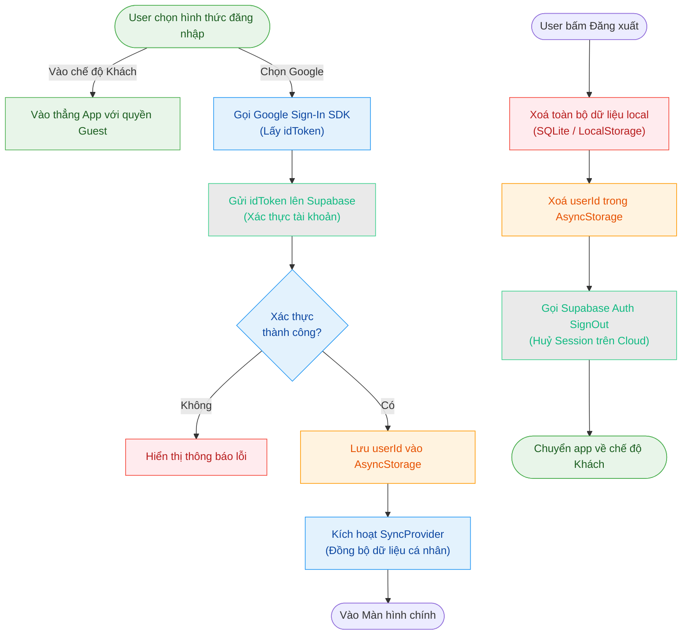
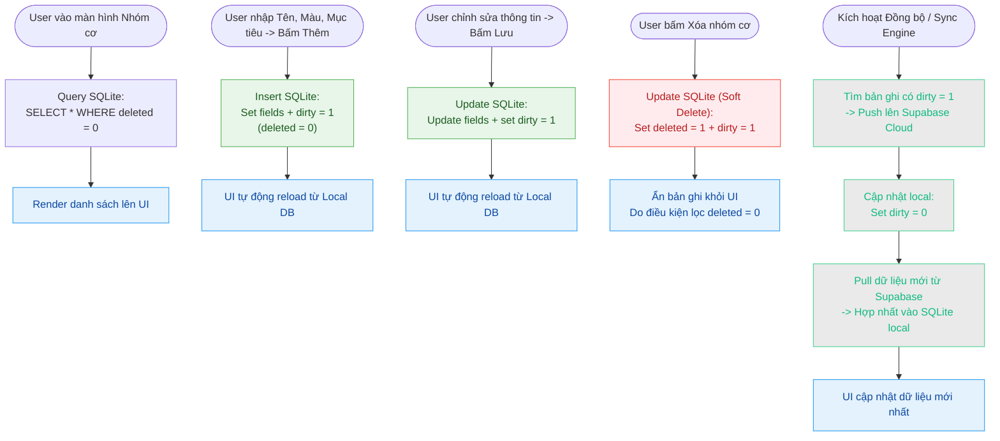
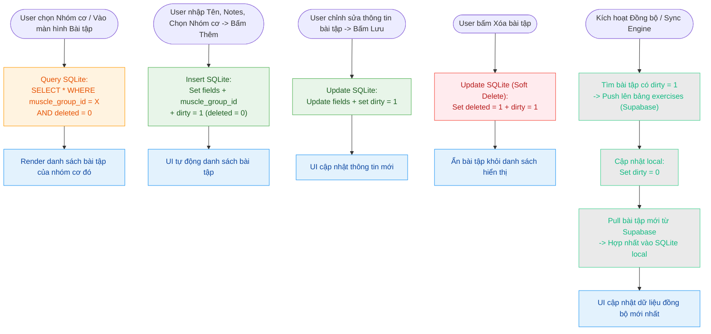
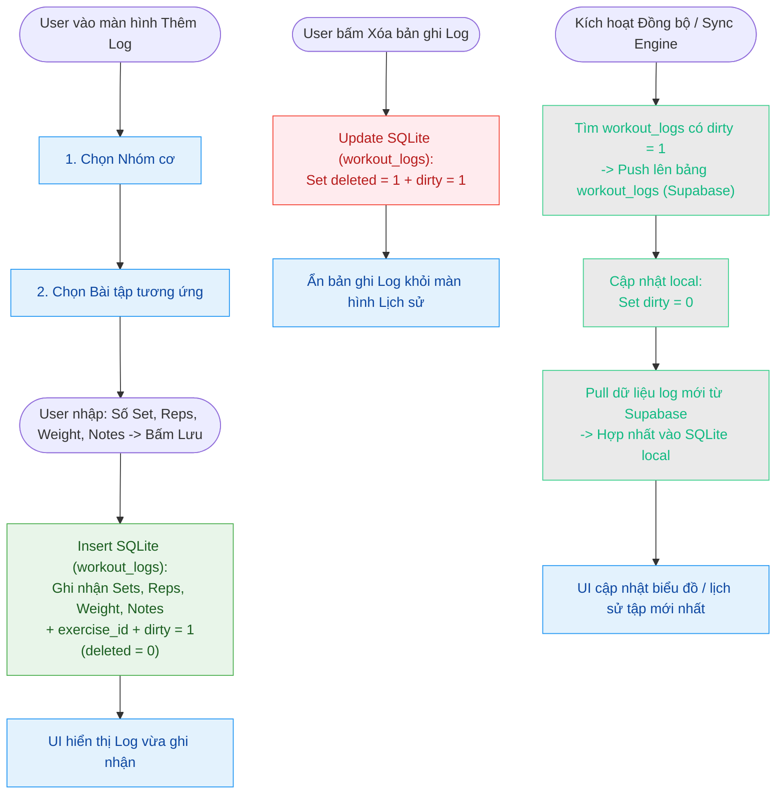
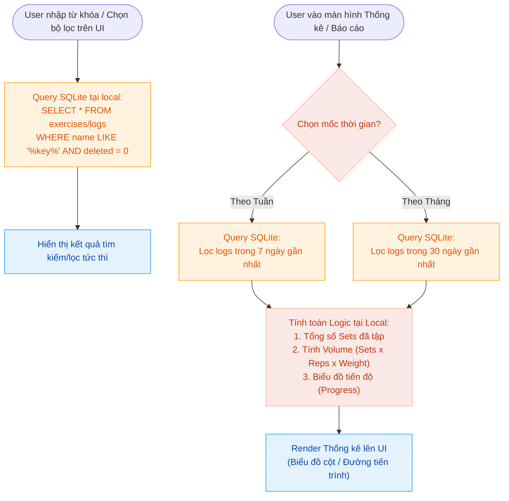
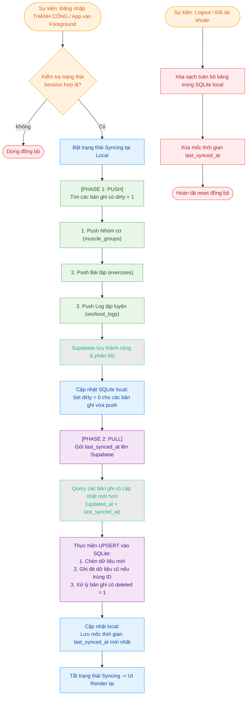
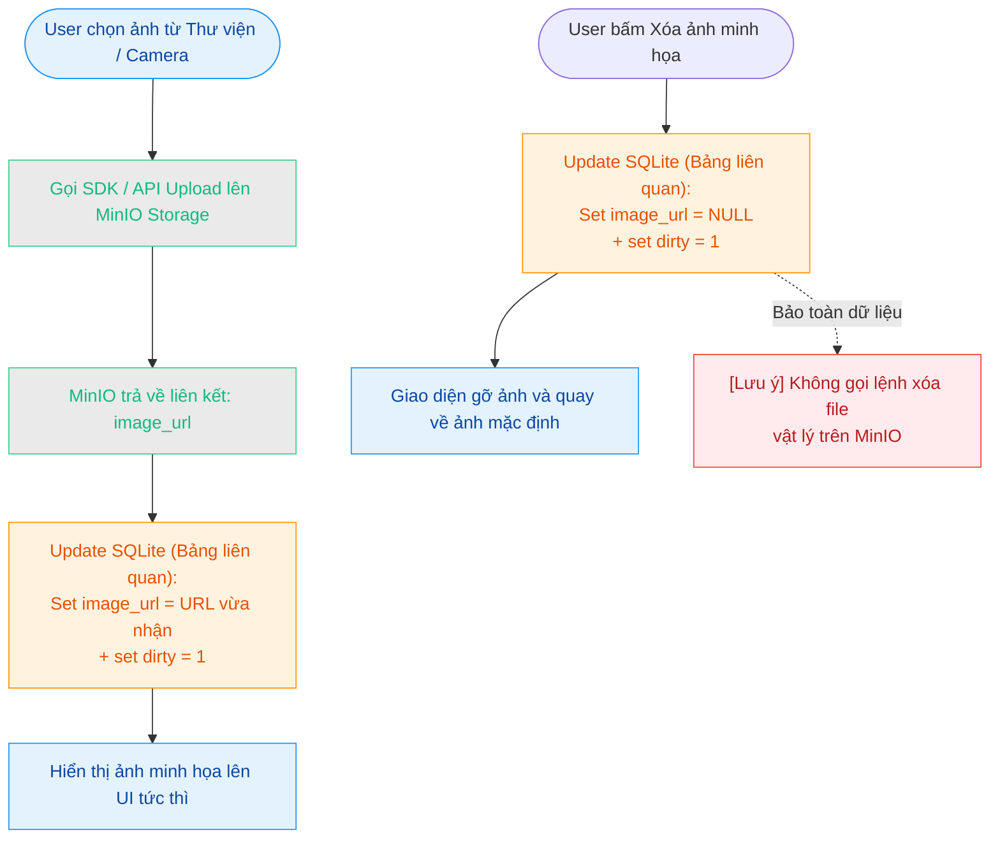

# Dataflow các chức năng chính

## 1. Đăng nhập/Đăng xuất
- Người dùng chọn đăng nhập Google hoặc vào chế độ Khách.
- Nếu Google: app gọi Google Sign-In, lấy idToken, gửi lên Supabase để xác thực.
- Nếu thành công, lưu userId vào AsyncStorage, đồng bộ dữ liệu cá nhân.
- Khi đăng xuất: xoá toàn bộ dữ liệu local, xoá session Supabase, chuyển về chế độ Khách.

## 2. Xem/Thêm/Sửa/Xoá nhóm cơ
- Xem: Đọc danh sách nhóm cơ từ localDB (SQLite), hiển thị UI.
- Thêm: Nhập tên, màu, mục tiêu, lưu vào localDB, đánh dấu dirty để đồng bộ cloud.
- Sửa: Sửa thông tin nhóm cơ, cập nhật localDB, đánh dấu dirty.
- Xoá: Đánh dấu deleted=1, dirty=1 trong localDB (soft delete), ẩn khỏi UI.
- Khi đồng bộ: push/pull dữ liệu nhóm cơ với Supabase.

## 3. Xem/Thêm/Sửa/Xoá bài tập
- Xem: Đọc danh sách bài tập từ localDB, lọc theo nhóm cơ.
- Thêm: Nhập tên, notes, lưu vào localDB, dirty=1.
- Sửa: Cập nhật thông tin, dirty=1.
- Xoá: Đánh dấu deleted=1, dirty=1 (soft delete).
- Khi đồng bộ: push/pull dữ liệu bài tập với Supabase.

## 4. Ghi log tập luyện
- Thêm log: Chọn nhóm cơ, bài tập, nhập số set, reps, weight, notes, lưu vào localDB, dirty=1.
- Xoá log: Đánh dấu deleted=1, dirty=1.
- Khi đồng bộ: push/pull log với Supabase.

## 5. Tìm kiếm, lọc, thống kê
- Tìm kiếm/lọc: Thực hiện trên dữ liệu local (SQLite), không gọi API.
- Thống kê: Tính toán số set, tiến độ theo tuần/tháng dựa trên log local.

## 6. Đồng bộ dữ liệu
- Khi đăng nhập hoặc app foreground, tự động đồng bộ local <-> Supabase.
- Push: Gửi các bản ghi dirty lên cloud (muscle group, exercise, log).
- Pull: Lấy các thay đổi mới từ cloud về local, cập nhật localDB.
- Nếu logout/switch user: xoá toàn bộ dữ liệu local, reset đồng bộ.

## 7. Upload/Xoá ảnh
- Khi chọn ảnh minh hoạ: upload lên MinIO, lấy URL, lưu vào localDB.
- Khi xoá: chỉ xoá link local, không xoá file trên MinIO.

## 8. Xử lý offline (không có mạng)

Khi thiết bị không có kết nối mạng:
- App vẫn hoạt động bình thường với mọi chức năng CRUD (xem, thêm, sửa, xoá) vì tất cả thao tác đều thực hiện trên localDB (SQLite) trước.
- SyncContext kiểm tra kết nối trước khi gọi syncData. Nếu mạng lỗi hoặc Supabase không phản hồi, thay vì để lỗi crash app, syncStatus được set thành 'error' kèm thông báo ngắn gọn.
- SyncStatusChip hiển thị icon cảnh báo và dòng chữ mô tả lỗi (ví dụ: "Không có mạng") thay vì crash hoặc hiển thị lỗi kỹ thuật khó hiểu.
- Các bản ghi vẫn được đánh dấu dirty=1 và sẽ tự động được đồng bộ lên cloud khi app quay lại foreground hoặc khi có mạng trở lại.
- Khi mạng phục hồi và app vào foreground, SyncProvider tự động kích hoạt lại syncData để đồng bộ toàn bộ bản ghi còn dirty.

---
Mọi thao tác CRUD đều thực hiện trên localDB trước, sau đó đồng bộ cloud khi có mạng và đăng nhập.